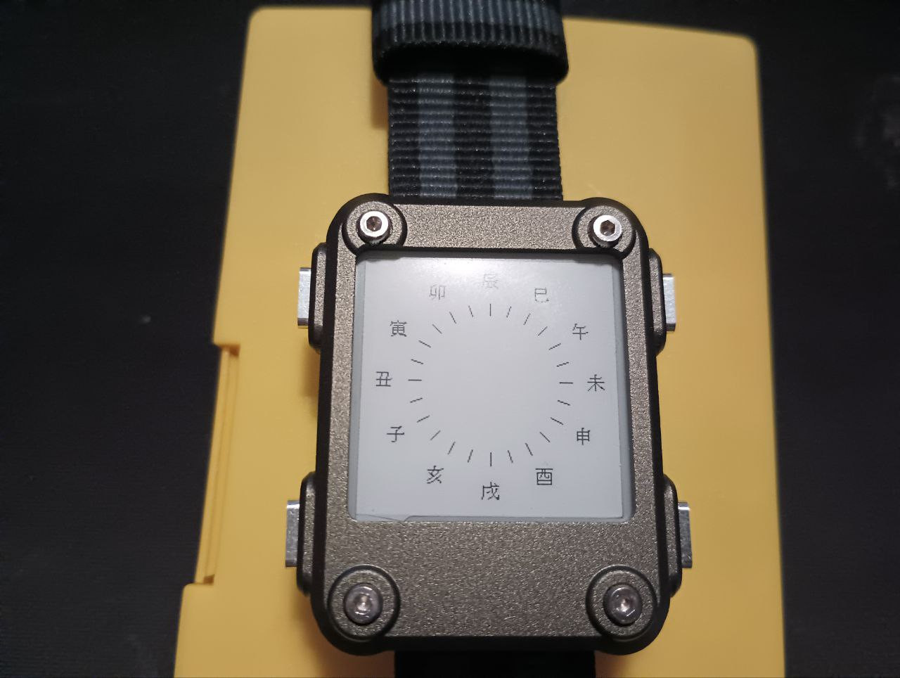

# watchy_wadokei

watchy_和時計

Please compile with my fork https://github.com/Sudrien/Watchy 
unless sqfmi/Watchy#233 is merged

Tools >> Manage Libraries >> Add "Sunset" (tested with 1.1.7)

Temporal clock.

Sunrise & Sunset are dependent on LAT and LON in settings.h. These should be set even if wifi and NTP are not configured. 

settings.vibrateOClock should be set to false - this is hard coded to hourly rings.

To stop the 'chime', comment out the call to `ringChime()` in `void WatchyWadokei::drawWatchFace()`.