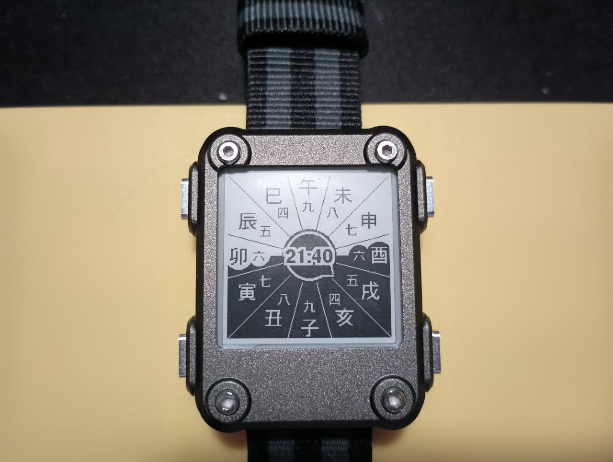

# watchy_wadokei

watchy_和時計

Please compile with my fork https://github.com/Sudrien/Watchy 
unless sqfmi/Watchy#233 is merged

Tools >> Manage Libraries >> Add "Sunset" (tested with 1.1.7)

Temporal clock.

Sunrise & Sunset are dependent on LAT and LON in settings.h. these should be set even if wifi and NTP are not configured. 